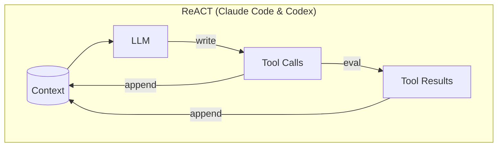
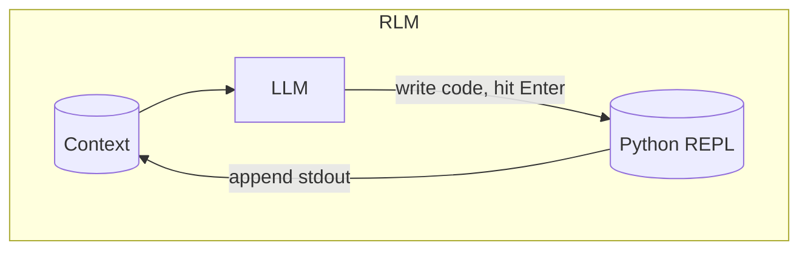
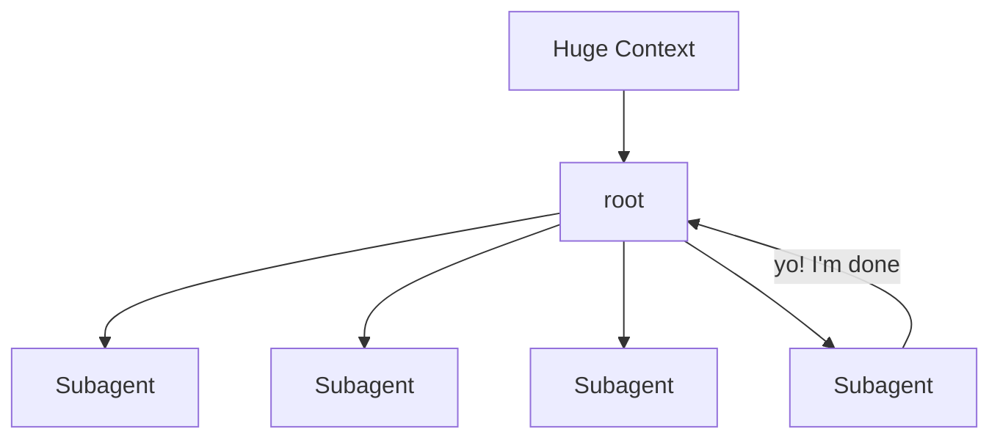
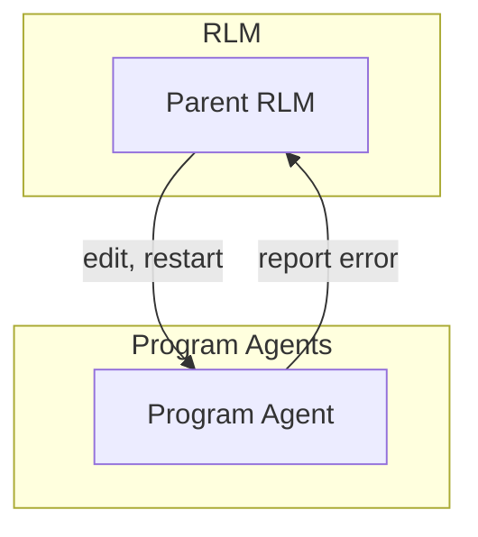

# DSH RLM & Program Agents

A set of plugins for DeepSeek Harness (DSH) that enables RLMs by default, as well as a new type of subagent, a Program Agent.

## What are RLMs & Program Agents

The normal DSH as well as Claude Code & Codex are all ReACT-style agents:



RLMs have the LLM work like a data scientist. It operates a "Jupyter Notebook", and so the agent now has state outside the LLM context, in variables.



So RLMs can operate over very large context using Python code. Code is reusable between REPL cells (e.g. create reusable functions).

Instead of flat sets of tools, RLM APIs are rich Python APIs with classes, methods, functions. It supports all sorts of things including message passing, timers, parallelism via Python asyncio, etc.



RLM code blocks get *very big*. The bigger the code blocks, the more the agent can do before returning back to the LLM.

What if the agent _**never**_ returned back to the LLM?

Enter program agents:



A program agent is a Python program with access to the same internal Python APIs as the RLM agent. So, when something goes wrong, the program agent can send a message back to it's parent RLM agent. Intelligent error handling! But by default, the LLM isn't ever used.

## Run with uv

**Experimental release:** available on [PyPI](https://pypi.org/project/dsh-rlm/) for **macOS (Apple Silicon and Intel) and glibc Linux (ARM64 and x86-64)**. Platform-specific runtime bundles are hosted on [GitHub Releases](https://github.com/tkellogg/dsh-rlm/releases).

```sh
uvx dsh-rlm
```

For a persistent command on your PATH:

```sh
uv tool install dsh-rlm
dsh-rlm
```

Need uv first? Follow [uv installation](https://docs.astral.sh/uv/getting-started/installation/).
uv manages the Python environment. On first launch, dsh-rlm downloads a checksummed,
version-matched prebuilt Node + DSH application from GitHub Releases. No existing
DSH, global Node, npm login, Git clone, or source build is required. Subsequent
launches reuse that application; ordinary startup never upgrades it.

```sh
uvx dsh-rlm setup                 # Revisit Settings → Setup
uvx dsh-rlm doctor                # Diagnose without downloading the application
uvx --upgrade dsh-rlm             # Upgrade uvx's package and launch
uv tool upgrade dsh-rlm           # Upgrade a persistent tool installation
```

Launch from your project directory. Credentials, sessions, and Python checkpoints
live outside uv's disposable tool cache, separately from ordinary DSH. First-run
setup offers installed provider adapters rather than requiring a DeepSeek key;
authentication methods depend on the chosen adapter and account. RLM Mode is the
default for new sessions.

Published platforms: macOS arm64/x86-64 and glibc Linux arm64/x86-64. The same Python package and command automatically select the matching runtime bundle. Windows and Alpine/musl are not currently supported.
See the [distribution guide](docs/distribution.md) for build, storage, and release details.

## Runtime capabilities

The working system provides:

- a distributable DSH Agent Preset named **RLM Mode**;
- a root controller whose only model-visible tool is `execute_python`;
- a persistent CPython namespace with top-level `await`;
- host-backed `runtime.tools` and `runtime.models` calls from Python;
- RLM children that inherit the persistent Python control plane, while Standard parents keep Standard children;
- native `asyncio` tasks and bounded local mailboxes;
- best-effort checkpoints with mandatory interruption notices; and
- one managed Python process per live RLM agent.

DSH remains responsible for provider routing, permissions, approvals, sessions,
tool execution, subprocess lifecycle, and the outer agent loop. The RLM plugin
keeps Python as the controller's working state and routes nested operations back
through those host services.

## Layout

- `project/python/` — tested Python runtime, REPL, checkpoint store, and JSONL bridge.
- `project/plugin/` — Cordis bundle, RLM preset, native tool, and host callback dispatcher.
- `research/` — design decisions and pinned DSH integration findings.

The integration target is DeepSeek Harness `0.1.6-alpha.2` at commit
`ddefc45fbc7f8e46dd73185e68295696d1297887`.
See [project/plugin/README.md](project/plugin/README.md) for build, install, and
startup instructions. For bounded inspection, task visibility, and active-cell delivery
recipes, see the [RLM runtime cookbook](docs/rlm-runtime-cookbook.md).

